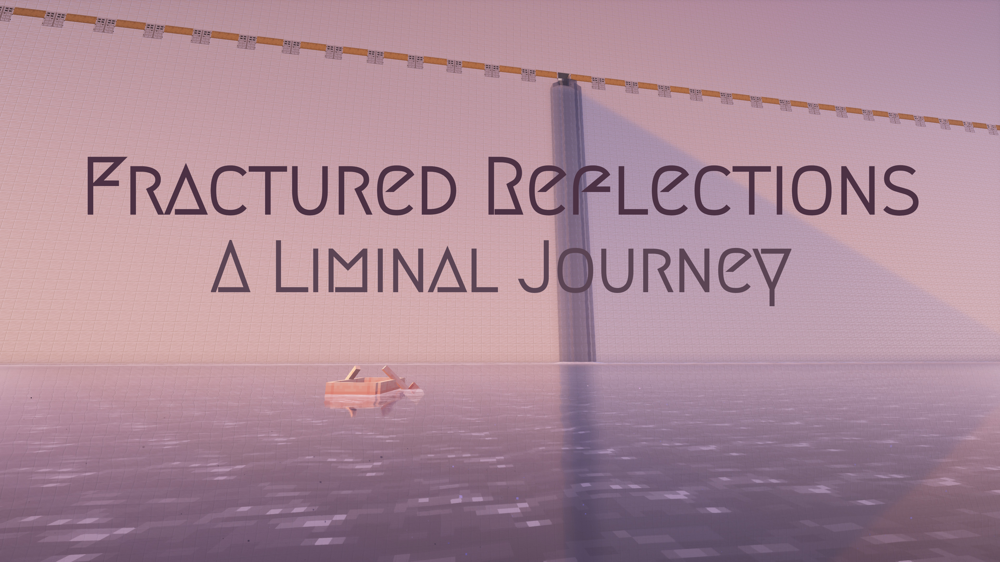

# 🟪 Fractured Reflections: A Liminal Journey

## 🌄 Adventure / Puzzle Minecraft map

### ⚠️ For: Minecraft Java Edition 1.20.1

[](https://github.com/F33RNI/FracturedReflections/archive/refs/heads/v1.zip)



----------

Step into a liminal, surreal and symbolic journey and uncover the feelings woven into its design. This is more than a game - it's a story told through art...

**Fractured Reflections: A Liminal Journey** takes you through familiar and unsettling places, twisting mazes, and endless landscapes, each filled with hidden meaning. The surreal environments and puzzles are crafted to evoke deep emotions and invite thoughtful exploration.

With experimental music and striking visuals, this map creates a powerful, immersive experience that lingers long after the journey ends. Prepare to reflect, discover, and connect in this artistic adventure.

----------

## 🗒️ Chapters

- The Childhood
- Cursed Playground
- Hollow Garden
- Lost in the Firmament
- Abyss
- Fragments
- \#\#\#\#\# \#\#\# \#\#\#\#\#\#\'\#
- The Escape?
- The Journey
- Temptation
- Dreams Come True
- Point of No Return
- Rebirth
- The Bridge
- Becoming

----------

## ⚠️ Rules

### 1. Install the Resource Pack

- The map includes a custom resource pack that must be installed by default (resources.zip).
- Verify proper installation: you should **NOT** see oak signs at spawn.

### 2. Enable Sounds and Music

- Turn ON all sounds and music in the game settings.
    Note: Each chapter has custom music triggered by command blocks. Avoid exiting the world or setting the music volume to 0.
- If the music stops playing for any reason, you can manually restart it with the following command:

    ```text
    /playsound minecraft:music.custom.<track_name> music @s ~ ~ ~ <volume 0-1>
    ```

    Example:

    ```text
    /playsound minecraft:music.custom.lost_in_the_firmament music @s ~ ~ ~ 0.8
    ```

- Play with headphones or high-quality speakers.

### 3. Adjust Video Settings

- **Render Distance:** 12 chunks
- **Simulation Distance:** 12 chunks
- **Entity Distance:** 70 - 110
- **Shaders:** Use Complementary Reimagined or a similar shader. Adjust performance settings within the shaders menu if needed.
- Disable clouds in the settings (and in shaders).

### 4. Play Fair

- Do not cheat.
- **Softlock Exception:** If you encounter a softlock, you may use /gamemode creative or /gamemode spectator to resolve the issue. Return to the adventure mode afterward.

### 5. Avoid Zoom Features

- Mods or tools that allow zooming are prohibited to preserve the intended experience.

----------

## 🎵 Tracklist

- The Childhood: `minecraft:music.custom.the_childhood`
- Cursed Playground: `minecraft:music.custom.cursed_playground`
- Hollow Garden: `minecraft:music.custom.hollow_garden`
- Lost in the Firmament: `minecraft:music.custom.lost_in_the_firmament`
- Abyss (overworld part): `minecraft:music.custom.crying_abyss`
- Abyss (nether part): `minecraft:music.custom.warped_abyss`
- Fragments: `minecraft:music.custom.fragments`
- \#\#\#\#\# \#\#\# \#\#\#\#\#\#\'\#: `minecraft:music.custom.those_who_couldn_t`
- The Escape?: `minecraft:music.custom.the_escape`
- The Journey (+ Temptation): `minecraft:music.custom.the_journey`
- Dreams Come True: `minecraft:music.custom.dreams_come_true`
- Point of No Return: `minecraft:music.custom.point_of_no_return`
- Rebirth: `minecraft:music.custom.rebirth`
- The Bridge (+ Becoming): `minecraft:music.custom.the_bridge`

**You can find an entire soundtrack on my [bandcamp](https://f3rni.bandcamp.com)**

> All tracks are licensed under Attribution Share Alike 3.0. You can use, remix and tweak even for commercial reasons, as long as you credit me and license your new creations under the identical terms.

----------

## ☕ Buy me a coffee

- **BTC:** `bc1qaj2ef2jlrt2uafn4kc9cmscuu8yqkjkvxxr5zu`
- **ETH:** `0x284E6121362ea1C69528eDEdc309fC8b90fA5578`
- **ZEC:** `t1Jb5tH61zcSTy2QyfsxftUEWHikdSYpPoz`
- **Other method:** DM me

----------

**I hope you enjoy my first map!** 💜

----------

- Music by **Fern Lane (F33RNI)**: <https://f3rni.bandcamp.com>
- Launcher by **Fern Lane (F33RNI)**: <https://github.com/F33RNI/micro-minecraft-launcher>
- Diary pages, testing, help and motivation: **Nick V.**: <https://github.com/Sprav04ka>
- Testing: **delerium_d**: <https://www.twitch.tv/delerium_d>
- Complementary Shaders by **EminGT**: <https://github.com/ComplementaryDevelopment/ComplementaryReimagined>
- Minecraft by **Mojang**: <https://www.minecraft.net>
